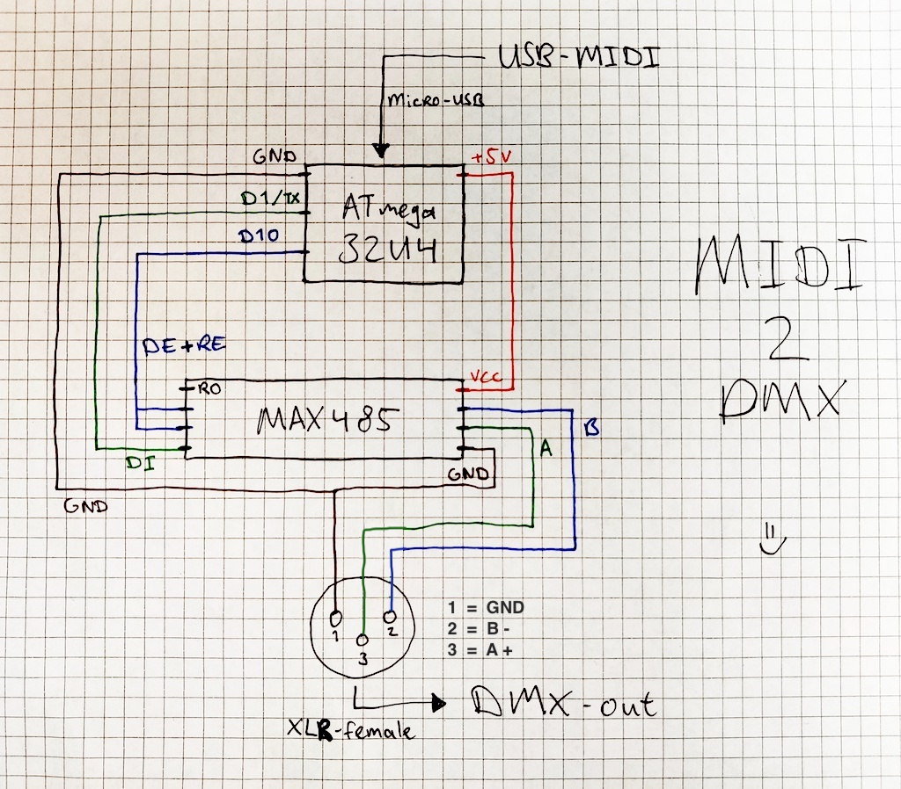
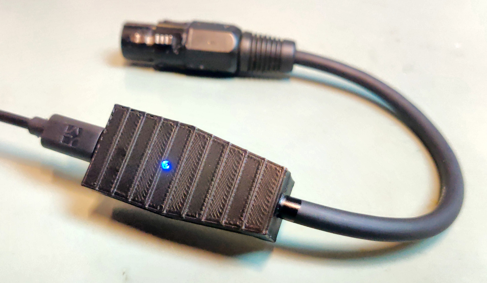
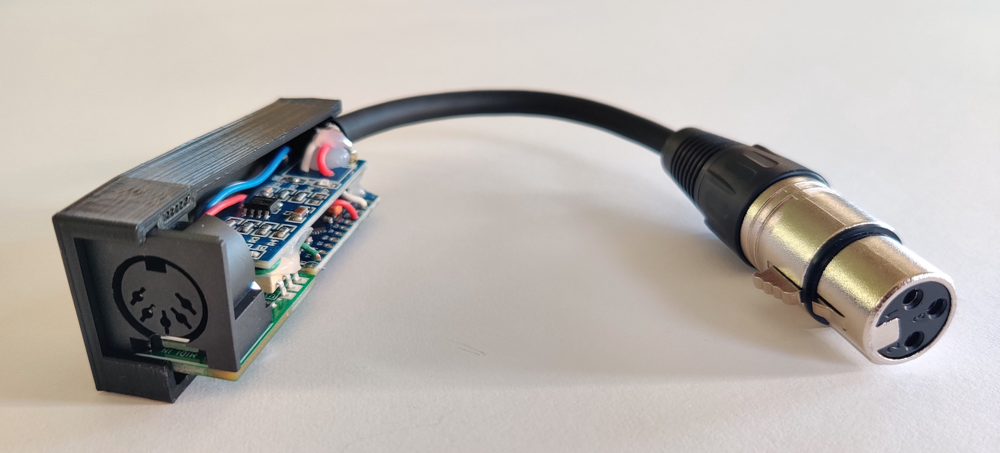

# MIDI2DMX

Check out my video tutorials on YouTube! :)
- [How to build your own USB-MIDI to DMX interface](https://youtu.be/dqrqfa0cMyE)
- [How to build your own MIDI to DMX interface (DIN5 to XLR)](https://youtu.be/rJIh-3a-4dY)

## MIDI-in to DMX-out

Firmware for a tiny but powerful MIDI device which acts just like any modern synthesizer or MIDI controller, but it doesn't make any sounds, it sends the MIDI messages as DMX values to your DMX lights system instead!

Now you will not need these big and expensive DMX modules anymore and you'll never have to leave your DAW again to some other app to program your light show! Sync your beats with your lights and create a lightshow simply using MIDI notes and MIDI control changes. Need more control? Update the firmware with your custom code or create an Ableton Max for Live patch to get even more out of it! And when you add the MIDI DIN5 input plug to your device, you can even use your synthesizer or MIDI controller to directly control your lights without using a computer, how awesome!

Enjoy! :)

## What hardware do I need?

- An **ATmega32U4** microcontroller, for example:
    - [Arduino Leonardo](https://docs.arduino.cc/hardware/leonardo)
    - [Arduino Micro](https://store.arduino.cc/products/arduino-micro)
    - [Arduino Pro Micro](https://www.sparkfun.com/products/12640)
    - [Adafruit ItsyBitsy](https://www.adafruit.com/product/3677)
    - [DFRobot Beetle](https://www.dfrobot.com/product-1075.html)
- A **MAX485** module ([amazon.com](https://www.amazon.com/Max485-Chip-RS-485-Module-Raspberry/dp/B00NIOLNAG/ref=sr_1_3?crid=2LWYPWLXT9T3W&keywords=max485&qid=1658936062&sprefix=max48%2Caps%2C170&sr=8-3))
- An **XLR-female** connector/panelmount or a short XLR cable to cut in half
- A **Micro-USB** cable
- Some (jumper) cables
- MIDI DIN5 input board (optional, see `schematics` to order the PCB yourself)

**NOTE:** Other Arduino microcontrollers are not tested. You will _NEED_ a microcontroller which has native-USB support, just like the 32U4, otherwise the USB-MIDI won't work. There are workarounds e.g. for the Arduino Uno, but I won't get into detail on that here.

## What software do I need?

- [Arduino IDE](https://www.arduino.cc/en/software)
- [Arduino MIDI Library](https://github.com/FortySevenEffects/arduino_midi_library)
- [Arduino MIDIUSB Library](https://github.com/arduino-libraries/MIDIUSB)
- [Arduino USB-MIDI Library](https://github.com/lathoub/Arduino-USBMIDI)
- [Arduino DmxSimple Library](https://github.com/PaulStoffregen/DmxSimple)

## How to upload the code?

Use the Arduino IDE and select **Arduino Leonardo** as the board, doesn't matter which 32U4 board you have from the list of boards above.

In case you are building the Beetle device from the first tutorial, start with the `midi2dmx-direct.ino` program.
In case you are building the DIN5 device from the second tutorial, start with the `midi2dmx-mapped.ino` program.

Do not forget to check the pin numbers and update them if necessary!

It might be that some of your lights need some channels to be on another state than 0 before they turn on at all. For example, I have some lights which need some channels to be 255 to turn on because of some program function which needs to be selected. So please init your lights in the method `initDmxChannels()` if they happen to need that!

If you are using a synthesizer to control your lights, you probably want to use the mapped version. But, every setup is different, and every light works differently, so please update the method `updateDmxChannels()` to match your lighting setup!

## Schematics

#### USB-MIDI to DMX-out

## Finished Devices

#### USB-MIDI to DMX-out

#### DIN5-MIDI to DMX-out

## You're welcome!

Bass Jansson, Technology for the Arts
